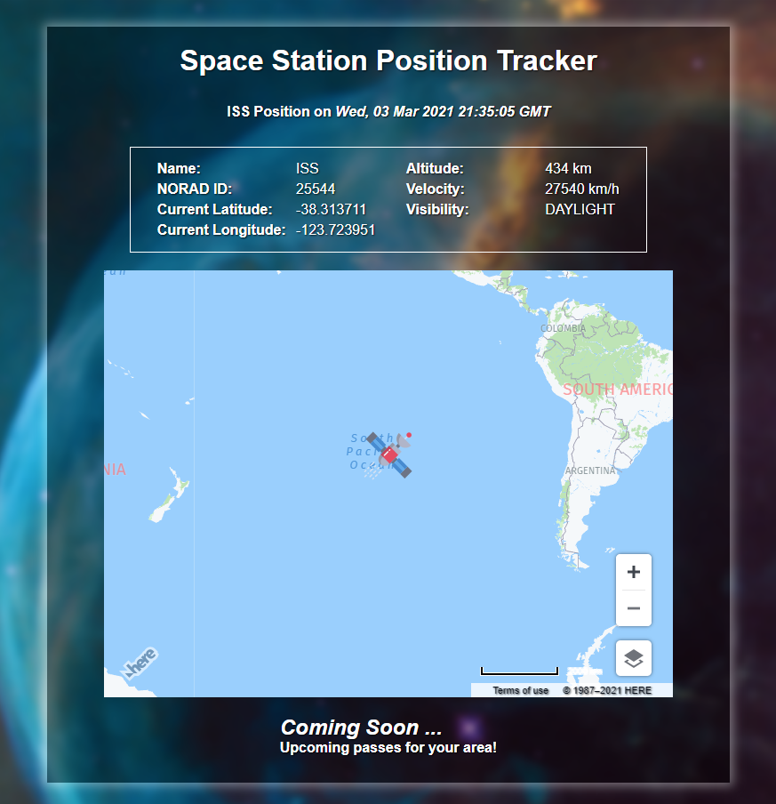

# Space Station Position Tracker

A HTML5 CSS3 & JavaScript project to access position data from the International Space Station and display in near real time on a map.

#### Libraries used:

- [Here Maps](https://developer.here.com/)
- [Open Notify Space API's](http://open-notify.org/)
- [Unsplash Source](https://source.unsplash.com/) - For space themed images.

[View LIVE here]()

##### Screenshot

